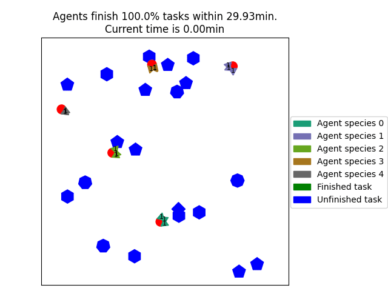

# HeteroMRTA
Code for RAL Paper: Heterogeneous Multi-robot Task Allocation and Scheduling via Reinforcement Learning.

This is a repository using deep reinforcement learning to address single-task agent (ST) multi-robot task(MR) task assignment problem.
We train agents make decisions sequentially, and then they are able to choose task in a decentralized manner in execution.

## Demo



## Code structure

Three main structures of the code are as below:
1. Environments: generate random tasks locations/ requirements and agents with their depot.
1. Neural network: network based on attention in Pytorch 
1. Ray framework: REINFORCE algorithm implementation in ray.

## Running instructions
1. Set hyperparameters in parameters.py then run ```python driver.py```
2. Testing the trained model by running ```python test.py```

1. requirements: 
    1. python => 3.6
    1. torch >= 1.8.1
    1. numpy, ray, matplotlib, scipy, pandas